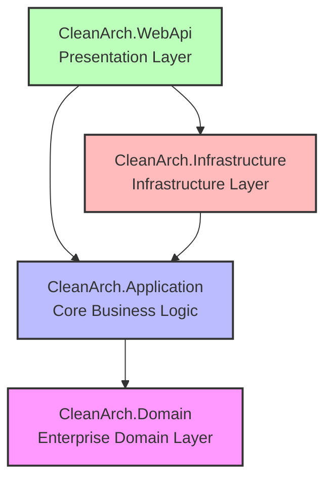

# 🚀 Modern .NET Web API: Clean Architecture & Vertical Slice Template

[မြန်မာဘာသာဖြင့် ဖတ်ရှုရန် (Read in Myanmar)](README.my.md)

This repository contains an enterprise-ready, zero-configuration Web API template built using **ASP.NET Core (.NET 10)**. It is structured around the principles of **Clean Architecture** for clear layer boundaries, combined with **Vertical Slice Architecture (Feature Folders)** inside the core application layer to maintain high cohesion and ease of change.

---

## 🏗️ Architecture Design & Philosophy

This template uses a hybrid architectural approach designed to solve the common issues of large software projects:
1. **Clean Architecture (Horizontal Project Boundaries)**: Separates concern into distinct layers (Domain, Application, Infrastructure, WebApi) to keep the core business rules independent of databases, UI frameworks, and external tools.
2. **Vertical Slice / Feature Folders (Vertical Organization)**: Within the Application layer, logic is grouped by **Features** (e.g., `Products`, `Orders`) instead of technical categories. This ensures all classes required for a single use case (Commands, Queries, DTOs, and Validators) live together in the same folder.



---

## 📂 Detailed Folder Structure

Here is the complete project tree highlighting where files live and how they are organized:

```text
CleanArch/
├── CleanArch.slnx                              # Modern XML-based Solution file
├── .gitignore                                  # Git exclusion rules for .NET, VS, and SQLite
├── README.md                                   # English documentation (Default)
├── README.my.md                                # Myanmar documentation
└── src/
    ├── CleanArch.Domain/                       # Domain Layer (Pure C#, No external dependencies)
    │   ├── Common/
    │   │   └── BaseEntity.cs                   # Base abstract class with Id & Audit columns
    │   └── Entities/
    │       └── Product.cs                      # Product domain entity
    │
    ├── CleanArch.Application/                  # Application Layer (Core business rules)
    │   ├── Common/
    │   │   ├── Behaviors/
    │   │   │   └── ValidationBehavior.cs       # MediatR validation pipeline interceptor
    │   │   └── Interfaces/
    │   │       └── IProductRepository.cs       # Database access contracts
    │   ├── Features/
    │   │   └── Products/                       # Product aggregate vertical slices
    │   │       ├── Commands/
    │   │       │   └── CreateProduct/
    │   │       │       ├── CreateProductCommand.cs
    │   │       │       └── CreateProductCommandValidator.cs
    │   │       └── Queries/
    │   │           ├── GetProductById/
    │   │           │   └── GetProductByIdQuery.cs
    │   │           └── GetProducts/
    │   │               ├── GetProductsQuery.cs
    │   │               └── ProductDto.cs
    │   └── DependencyInjection.cs               # Registering MediatR & FluentValidation
    │
    ├── CleanArch.Infrastructure/               # Infrastructure Layer (External tools & Persistence)
    │   ├── Persistence/
    │   │   ├── Repositories/
    │   │   │   └── ProductRepository.cs        # EF Core repository implementation
    │   │   ├── ApplicationDbContext.cs         # Entity Framework database context
    │   │   └── ApplicationDbContextInitializer.cs  # SQLite database creator & dummy data seeder
    │   └── DependencyInjection.cs               # Registering DbContext and repositories
    │
    └── CleanArch.WebApi/                       # Presentation Layer (API Host & Routes)
        ├── Controllers/
        │   ├── ApiControllerBase.cs            # Base controller injecting MediatR ISender
        │   └── ProductsController.cs           # HTTP REST endpoints for products
        ├── Middleware/
        │   └── ApiExceptionHandlingMiddleware.cs # Global Exception filter mapping errors to RFC 7807
        ├── Properties/
        │   └── launchSettings.json             # Profiles configuring ports and autostart page
        ├── appsettings.json                    # Configuration (Connection strings, Logging)
        └── Program.cs                          # Application entry point & service wiring
```

---

## 🔄 Use Case Execution Flow

When a client hits an API endpoint, the request flows through the clean boundaries using the Mediator pattern:

```text
 [ HTTP POST /api/products ]
            │
            ▼
┌───────────────────────┐
│  ProductsController   │  <-- Endpoint receives JSON payload
└───────────┬───────────┘
            │  (Sends CreateProductCommand via MediatR)
            ▼
┌───────────────────────┐
│   ValidationBehavior  │  <-- Pipeline Interceptor checks FluentValidation rules.
└───────────┬───────────┘      Throws ValidationException if rules fail.
            │  (Valid request proceeds)
            ▼
┌───────────────────────┐
│   CreateProductCmd    │
│        Handler        │  <-- Executes logic, maps DTO to Domain Entity
└───────────┬───────────┘
            │  (Calls IProductRepository.AddAsync)
            ▼
┌───────────────────────┐
│   ProductRepository   │  <-- Infrastructure implements SQL operations via EF Core
└───────────┬───────────┘
            │
            ▼
┌───────────────────────┐
│  SQLite Local DB      │  <-- Entity is saved to SQLite disk file (CleanArch.db)
└───────────────────────┘
```

---

## 🛠️ Core Technologies & Packages Used

- **Runtime:** .NET 10.0
- **Database Context (ORM):** Entity Framework Core 10
- **Database Engine:** SQLite (`Microsoft.EntityFrameworkCore.Sqlite`)
- **CQRS Pattern Orchestrator:** MediatR (`MediatR`)
- **Model Validation:** FluentValidation (`FluentValidation.DependencyInjectionExtensions`)
- **API Documentation & Testing UI:** Scalar (`Scalar.AspNetCore` with Native OpenAPI Document Generation)

---

## 💡 How-To Guides

### 1. How to Add a New Feature (e.g., `Order`)
To add a new database-backed aggregate in this codebase, follow these steps in order:
1. **Domain:** Add `Order` entity inheriting from `BaseEntity` under `CleanArch.Domain/Entities/`.
2. **Application:**
   - Define `IOrderRepository` under `CleanArch.Application/Common/Interfaces/`.
   - Create a folder `CleanArch.Application/Features/Orders/Commands/CreateOrder/`.
   - Write `CreateOrderCommand`, `CreateOrderCommandValidator`, and `CreateOrderCommandHandler`.
3. **Infrastructure:**
   - Add a `DbSet<Order> Orders` to `ApplicationDbContext`.
   - Implement `OrderRepository` in `CleanArch.Infrastructure/Persistence/Repositories/`.
   - Register the repository in `CleanArch.Infrastructure/DependencyInjection.cs`:
     ```csharp
     services.AddScoped<IOrderRepository, OrderRepository>();
     ```
4. **WebApi:**
   - Create `OrdersController.cs` in `CleanArch.WebApi/Controllers/` inheriting from `ApiControllerBase`.
   - Add endpoint actions sending commands/queries to MediatR.

### 2. How to Switch from SQLite to SQL Server
For production, you can easily change the database provider in the Infrastructure layer:
1. Install the NuGet package `Microsoft.EntityFrameworkCore.SqlServer` in `CleanArch.Infrastructure.csproj`.
2. Update the connection string in `CleanArch.WebApi/appsettings.json`:
   ```json
   "ConnectionStrings": {
     "DefaultConnection": "Server=YOUR_SERVER;Database=CleanArchDb;Trusted_Connection=True;TrustServerCertificate=True;"
   }
   ```
3. Update `CleanArch.Infrastructure/DependencyInjection.cs` to use SQL Server:
   ```csharp
   services.AddDbContext<ApplicationDbContext>(options =>
       options.UseSqlServer(connectionString));
   ```

### 3. How to Integrate a Frontend Project (`.client`)
You can integrate an Angular, React, Vue, or Svelte client directly inside the solution directory:
1. Run Vite or Angular CLI in the root directory to create the client folder:
   ```bash
   npx create-vite@latest src/CleanArch.Client --template react-ts
   ```
2. Configure proxy settings in the frontend dev-server (e.g., `vite.config.ts`) to forward API requests:
   ```typescript
   server: {
     proxy: {
       '/api': {
         target: 'http://localhost:5076',
         changeOrigin: true,
         secure: false
       }
     }
   }
   ```
3. In Visual Studio, you can configure both projects to run simultaneously using **Multiple Startup Projects** (WebApi + Client).

---

## 🚀 Getting Started

### 1. Running the API
From the root directory of the project, run:
```bash
dotnet run --project src/CleanArch.WebApi
```
Or in **Visual Studio**, right-click `CleanArch.WebApi` -> **Set as Startup Project**, and press **F5**.

### 2. Testing Endpoints in Scalar UI
Once launched, the browser will open to the interactive **Scalar Documentation UI**:
*   👉 **`http://localhost:5076/scalar/v1`** (or `https://localhost:7013/scalar/v1`)

You can inspect the JSON request payloads, invoke routes, and verify error outputs (such as trying to create a product with an empty name or price set to `<= 0` to trigger FluentValidation).
