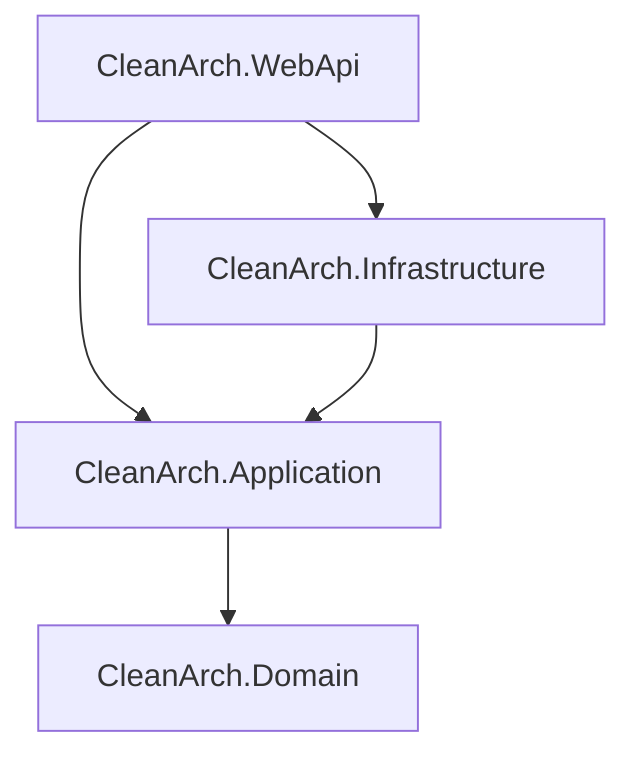

# .NET Clean Architecture with Vertical Slice Template

[မြန်မာဘာသာဖြင့် ဖတ်ရှုရန် (Read in Myanmar)](README.my.md)

This repository contains a modern web API template built using **ASP.NET Core** and structured according to **Clean Architecture** principles, combined with a **Vertical Slice (Feature-based)** organization inside the core application layer.

---

## 🏗️ Architecture Overview

The project combines **Clean Architecture** (to separate concerns across independent horizontal projects) and **Vertical Slice Architecture** (grouping business logic by use cases inside the Application layer).



### Project Layers
1. **`CleanArch.Domain` (Core Domain)**
   - No external dependencies (pure C#).
   - Contains Enterprise Entities, Value Objects, Domain Exceptions, and core base classes like [BaseEntity](src/CleanArch.Domain/Common/BaseEntity.cs).
2. **`CleanArch.Application` (Business Logic)**
   - Holds application-specific logic, interfaces, CQRS use cases, and DTOs.
   - Organized by **Features / Vertical Slices** (e.g. `CreateProduct`, `GetProducts`) where the Command, Validator, and Handler reside in the same folder.
   - Implements automated request validation using a MediatR Pipeline Behavior.
3. **`CleanArch.Infrastructure` (Data & External Services)**
   - Implements repositories and db contexts defined in the Application layer.
   - Utilizes Entity Framework Core with **SQLite** for zero-configuration local database persistence.
   - Handles auto-creation and seeding of dummy test database on startup in Development mode.
4. **`CleanArch.WebApi` (Presentation)**
   - Exposes HTTP REST endpoints via Controllers.
   - Features custom global exception middleware mapping validation and system errors into RFC 7807 Problem Details.
   - Configures native OpenAPI generation and **Scalar API Reference** UI.

---

## 🛠️ Technologies & Packages Used

- **Framework:** .NET 10.0
- **Database ORM:** Entity Framework Core 10
- **Database Provider:** SQLite (`Microsoft.EntityFrameworkCore.Sqlite`)
- **CQRS Pattern:** MediatR (`MediatR`)
- **Validation:** FluentValidation (`FluentValidation.DependencyInjectionExtensions`)
- **API Documentation UI:** Scalar (`Scalar.AspNetCore`)

---

## 💻 Frontend Client Integration (`.client`)

If you want to build a Full-stack application, you can add a frontend client project (such as **Angular**, **React**, or **Vue**) directly into the solution. 

We recommend adding the client project under a folder named `CleanArch.Client` or simply `src/CleanArch.Client` (often suffixed with `.client`).
- **Development Setup:** Configure a proxy in your frontend dev-server (e.g., `vite.config.ts` or `proxy.conf.json`) to forward API requests from the client port (e.g., `http://localhost:5173`) to the backend API port (`http://localhost:5076/api`).
- **Production Setup:** You can configure the WebApi to serve static files from the compiled client output directory (`dist/` or `build/`), or deploy them as separate decoupled services.

---

## 🚀 How to Run the Application

### 1. Prerequisites
- Ensure you have **.NET 10 SDK** installed on your machine.

### 2. Run via Command Line
Run the WebApi project directly from the repository root:
```bash
dotnet run --project src/CleanArch.WebApi
```

### 3. Run via Visual Studio
1. Right-click the **`CleanArch.WebApi`** project in the Solution Explorer.
2. Select **"Set as Startup Project"**.
3. Press **`F5`** or click the green **Play** button.

---

## 🔍 Testing the Endpoints

Once the application starts, it will automatically:
1. Create the SQLite local database file (`CleanArch.db`) at the root of the WebApi project.
2. Seed the database with initial products.
3. Open your default web browser to the interactive **Scalar API documentation UI** page:

*   👉 **`http://localhost:5076/scalar/v1`** (or `https://localhost:7013/scalar/v1`)

### Sample endpoints to test:
- **`GET /api/products`** - Get the list of all products.
- **`GET /api/products/{id}`** - Retrieve a single product's details.
- **`POST /api/products`** - Create a new product (validates that `Name` is not empty and `Price` is greater than 0).
