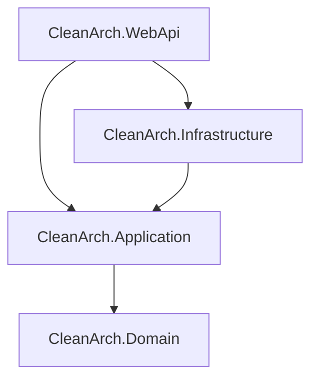

# .NET Clean Architecture with Vertical Slice Template (မြန်မာဘာသာ)

[Read in English (အင်္ဂလိပ်ဘာသာဖြင့် ဖတ်ရှုရန်)](README.md)

ဤ Repository သည် **ASP.NET Core** ကို အသုံးပြု၍ တည်ဆောက်ထားသော ခေတ်မီ Web API Template တစ်ခု ဖြစ်ပြီး **Clean Architecture** အခြေခံစည်းမျဉ်းများအပြင် Core Application Layer အတွင်း၌ **Vertical Slice (Feature-based)** တည်ဆောက်ပုံစနစ်ကို ပေါင်းစပ်ဖွဲ့စည်းထားပါသည်။

---

## 🏗️ Architecture ဖွဲ့စည်းပုံ ရှင်းလင်းချက်

ဤ Project တွင် Horizontal ပိုင်းခြားမှုအတွက် **Clean Architecture** (သီးခြား Project Layer များ ခွဲထုတ်ခြင်း) နှင့် Application Layer အတွင်း Use Case တစ်ခုချင်းစီအလိုက် စုစည်းခြင်းအတွက် **Vertical Slice Architecture** (Feature Folder Grouping) တို့ကို ပေါင်းစပ်အသုံးပြုထားသည်။



### Layer တစ်ခုချင်းစီ၏ တာဝန်များ
1. **`CleanArch.Domain` (Core Domain)**
   - မည်သည့် ပြင်ပ dependency မှ မပါရှိသော သီးသန့် C# Project ဖြစ်သည်။
   - လုပ်ငန်းလုပ်ဆောင်ချက်ဆိုင်ရာ Domain Entities, Value Objects, Domain Exceptions နှင့် [BaseEntity](src/CleanArch.Domain/Common/BaseEntity.cs) ကဲ့သို့သော ဘုံ base class များ ပါဝင်သည်။
2. **`CleanArch.Application` (Business Logic)**
   - လုပ်ငန်းသုံး Application Logic များ၊ Interfaces များ၊ CQRS Use Cases များနှင့် DTO များ ပါဝင်သည်။
   - **Features / Vertical Slices** စနစ်ဖြင့် ဖွဲ့စည်းထားပြီး (ဥပမာ - `CreateProduct`၊ `GetProducts`) သက်ဆိုင်ရာ Command၊ Validator နှင့် Handler တို့သည် folder တစ်ခုတည်းအောက်တွင် အတူတကွ ရှိနေသည်။
   - MediatR Pipeline Behavior ကို အသုံးပြု၍ ဝင်လာသော request များကို အလိုအလျောက် Validation စစ်ဆေးပေးသည်။
3. **`CleanArch.Infrastructure` (Data & External Services)**
   - Application Layer တွင် သတ်မှတ်ထားသော interfaces များနှင့် Database Context များကို အကောင်အထည်ဖော်ပေးသည်။
   - local development database persistence အတွက် Entity Framework Core နှင့် **SQLite** ကို အသုံးပြုထားသည်။
   - Development mode တွင် application စတင်ချိန်၌ စမ်းသပ်ရန် database ကို အလိုအလျောက်ဖန်တီးပေးပြီး dummy database data များကို စတင်ထည့်သွင်းပေးသည် (Auto-Seeding)။
4. **`CleanArch.WebApi` (Presentation)**
   - Controller များမှတစ်ဆင့် HTTP REST endpoints များကို ထုတ်ဖော်ပေးသည်။
   - ဝင်လာသော system error များနှင့် validation error များကို RFC 7807 Problem Details Standard အတိုင်း စနစ်တကျ ပြန်လည်ထုတ်ပေးမည့် Custom exception handling middleware ပါဝင်သည်။
   - Native OpenAPI specification generate ပြုလုပ်ခြင်းနှင့် ခေတ်မီ **Scalar API Reference** UI တို့ကို configure လုပ်ထားသည်။

---

## 🛠️ အသုံးပြုထားသော နည်းပညာများနှင့် NuGet Packages

- **Framework:** .NET 10.0
- **Database ORM:** Entity Framework Core 10
- **Database Provider:** SQLite (`Microsoft.EntityFrameworkCore.Sqlite`)
- **CQRS Pattern:** MediatR (`MediatR`)
- **Validation:** FluentValidation (`FluentValidation.DependencyInjectionExtensions`)
- **API Documentation UI:** Scalar (`Scalar.AspNetCore`)

---

## 💻 Frontend Client Integration (`.client`)

အကယ်၍ Full-stack Application တစ်ခုအဖြစ် တည်ဆောက်လိုပါက Frontend Client Project (ဥပမာ - **Angular**, **React** သို့မဟုတ် **Vue**) တစ်ခုကို Solution ထဲသို့ ထည့်သွင်းချိတ်ဆက်နိုင်ပါသည်။

Frontend Project ကို `CleanArch.Client` (သို့မဟုတ် `src/CleanArch.Client`) နာမည်ပေး၍ ထည့်သွင်းရန် အကြံပြုပါသည် (များသောအားဖြင့် `.client` suffix ဖြင့် သတ်မှတ်လေ့ရှိသည်)။
- **Development Setup:** Frontend dev-server (ဥပမာ- `vite.config.ts` သို့မဟုတ် `proxy.conf.json`) ထဲတွင် Backend API port (`http://localhost:5076/api`) သို့ API calls များ ရောက်ရှိစေရန် Proxy configuration ပြင်ဆင်ပေးရပါမည်။
- **Production Setup:** WebApi ထဲတွင် compile ထွက်လာသည့် frontend binary files (dist/ သို့မဟုတ် build/) များကို Static Files အဖြစ် client သို့ ပြန်လည် serve လုပ်ရန် configure ပြင်ဆင်နိုင်သည် သို့မဟုတ် backend နှင့် frontend ကို သီးခြားစီ deploy လုပ်နိုင်သည်။

---

## 🚀 Application စမ်းသပ်မောင်းနှင်ပုံ

### ၁။ ကြိုတင်လိုအပ်ချက်
- သင့်စက်တွင် **.NET 10 SDK** တပ်ဆင်ထားရန် လိုအပ်သည်။

### ၂။ Command Line မှတစ်ဆင့် Run ရန်
ပရောဂျက် root လမ်းကြောင်းအောက်တွင် အောက်ပါ command ကို ရိုက်နှိပ်ပါ-
```bash
dotnet run --project src/CleanArch.WebApi
```

### ၃။ Visual Studio မှတစ်ဆင့် Run ရန်
1. Visual Studio Solution Explorer ထဲရှိ **`CleanArch.WebApi`** project ပေါ်တွင် **Right-Click** နှိပ်ပါ။
2. **"Set as Startup Project"** ကို ရွေးချယ်ပါ။
3. ကီးဘုတ်မှ **`F5`** ကို နှိပ်ပါ သို့မဟုတ် အစိမ်းရောင် **Play** ခလုတ်ကို နှိပ်ပါ။

---

## 🔍 API Endpoints များကို စမ်းသပ်ခြင်း

Application စတင်မောင်းနှင်ပါက အောက်ပါတို့ကို အလိုအလျောက် လုပ်ဆောင်ပေးမည်ဖြစ်သည်-
1. WebApi project root အောက်တွင် local SQLite database ဖိုင်ဖြစ်သော `CleanArch.db` ကို ဆောက်ပေးမည်။
2. အစမ်း product data များကို database ထဲသို့ ထည့်သွင်းပေးမည်။
3. Browser တွင် အောက်ပါ **Scalar API Documentation UI** စာမျက်နှာကို တိုက်ရိုက်ဖွင့်ပေးမည်ဖြစ်သည်-

*   👉 **`http://localhost:5076/scalar/v1`** (သို့မဟုတ် `https://localhost:7013/scalar/v1`)

### စမ်းသပ်နိုင်သည့် Endpoint နမူနာများ-
- **`GET /api/products`** - Product အားလုံးကို list ပြပေးသည်။
- **`GET /api/products/{id}`** - သက်ဆိုင်ရာ Product ၏ အသေးစိတ်အချက်အလက်များကို ပြပေးသည်။
- **`POST /api/products`** - Product အသစ်တစ်ခု ဆောက်ပေးသည် (`Name` မပါဝင်ခြင်း သို့မဟုတ် `Price` သည် ၀ ထက်နည်းပါက custom validator မှ စစ်ထုတ်ပေးမည်ဖြစ်သည်)။
