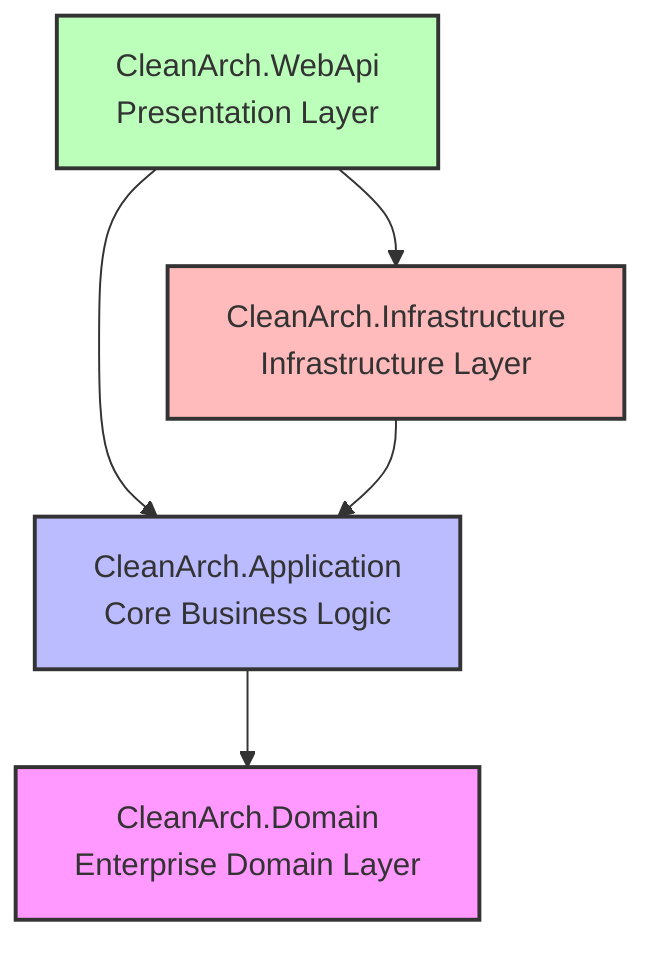

# 🚀 Modern .NET Web API: Clean Architecture & Vertical Slice Template (မြန်မာဘာသာ)

[Read in English (အင်္ဂလိပ်ဘာသာဖြင့် ဖတ်ရှုရန်)](README.md)

ဤ Repository သည် Enterprise-ready ဖြစ်ပြီး zero-configuration ဖြင့် မောင်းနှင်နိုင်သော **ASP.NET Core (.NET 10)** Web API Template ဖြစ်သည်။ ၎င်းသည် စနစ်တကျရှိသော layer boundary များ ရရှိစေရန် **Clean Architecture** အခြေခံစည်းမျဉ်းများဖြင့် ဖွဲ့စည်းထားပြီး၊ Core Application Layer အတွင်း၌ လုပ်ဆောင်ချက်များကို သန့်ရှင်းသပ်ရပ်စွာ ပြင်ဆင်နိုင်ရန် **Vertical Slice Architecture (Feature Folders)** တည်ဆောက်ပုံစနစ်ကို ပေါင်းစပ်အသုံးပြုထားသည်။

---

## 🏗️ Architecture Design နှင့် သဘောတရား

ဤ Template တွင် ခေတ်မီဆော့ဖ်ဝဲလ်ပရောဂျက်ကြီးများတွင် ကြုံတွေ့ရလေ့ရှိသော ပြဿနာများကို ဖြေရှင်းနိုင်ရန် ဖွဲ့စည်းပုံနှစ်ခုကို ပေါင်းစပ်အသုံးပြုထားပါသည်-
1. **Clean Architecture (Horizontal Project Boundaries)**: လုပ်ငန်းလုပ်ဆောင်ချက်ဆိုင်ရာ Core Business Rules (Domain & Application Logic) များကို ပြင်ပ database များ၊ UI frameworks များနှင့် အခြားသော ပြင်ပ tools များမှ ကင်းလွတ်ပြီး သီးခြားလွတ်လပ်စွာ တည်ရှိနိုင်ရန် Layer များ ခွဲခြားထားသည်။
2. **Vertical Slice / Feature Folders (Vertical Organization)**: Application Layer အတွင်း၌ Logic များကို technical types များအလိုက် စုစည်းခြင်းမပြုဘဲ **Features** (ဥပမာ- `Products`, `Orders`) အလိုက် စုစည်းထားသည်။ ထို့ကြောင့် Use Case တစ်ခု (ဥပမာ- Product အသစ်ဆောက်ခြင်း) အတွက် လိုအပ်သော Commands, Queries, DTOs နှင့် Validators အားလုံးသည် folder တစ်ခုတည်းအောက်တွင် စုစည်းတည်ရှိနေသည်။



---

## 📂 အသေးစိတ် Folder ဖွဲ့စည်းပုံ

Project directory အတွင်း ဖိုင်များ မည်သို့တည်ရှိပြီး ဖွဲ့စည်းထားပုံကို အောက်ပါအတိုင်း တွေ့မြင်နိုင်သည်-

```text
CleanArch/
├── CleanArch.slnx                              # Modern XML-based Solution file
├── .gitignore                                  # C#/.NET, Visual Studio နှင့် SQLite ဆိုင်ရာ git ignore rules
├── README.md                                   # အင်္ဂလိပ်ဘာသာဖြင့် ရေးထားသော လမ်းညွှန်ချက် (Default)
├── README.my.md                                # မြန်မာဘာသာဖြင့် ရေးထားသော လမ်းညွှန်ချက်
└── src/
    ├── CleanArch.Domain/                       # Domain Layer (Pure C#, ပြင်ပ dependency မပါဝင်ပါ)
    │   ├── Common/
    │   │   └── BaseEntity.cs                   # Id နှင့် Audit fields များ ပါဝင်သော base abstract class
    │   └── Entities/
    │       └── Product.cs                      # Product domain entity
    │
    ├── CleanArch.Application/                  # Application Layer (Core business rules)
    │   ├── Common/
    │   │   ├── Behaviors/
    │   │   │   └── ValidationBehavior.cs       # MediatR validation pipeline interceptor
    │   │   └── Interfaces/
    │   │       └── IProductRepository.cs       # database access contract interface
    │   ├── Features/
    │   │   └── Products/                       # Product features နှင့်ပတ်သက်သော vertical slices
    │   │       ├── Commands/
    │   │       │   └── CreateProduct/
    │   │       │       ├── CreateProductCommand.cs
    │   │       │       └── CreateProductCommandValidator.cs
    │   │       └── Queries/
    │   │           ├── GetProductById/
    │   │           │   └── GetProductByIdQuery.cs
    │   │           └── GetProducts/
    │   │               ├── GetProductsQuery.cs
    │   │               └── ProductDto.cs
    │   └── DependencyInjection.cs               # MediatR နှင့် FluentValidation များကို DI register လုပ်ခြင်း
    │
    ├── CleanArch.Infrastructure/               # Infrastructure Layer (ပြင်ပ Tools နှင့် Persistence)
    │   ├── Persistence/
    │   │   ├── Repositories/
    │   │   │   └── ProductRepository.cs        # EF Core သုံးပြီး ရေးထားသော database repo implementation
    │   │   ├── ApplicationDbContext.cs         # Entity Framework db context
    │   │   └── ApplicationDbContextInitializer.cs  # local development database Auto-Seed ပြုလုပ်ပေးသည့် class
    │   └── DependencyInjection.cs               # DbContext နှင့် repositories များကို register လုပ်ခြင်း
    │
    └── CleanArch.WebApi/                       # Presentation Layer (API Host & Host configuration)
        ├── Controllers/
        │   ├── ApiControllerBase.cs            # MediatR ISender ကို inject လုပ်ပေးထားသော base controller
        │   └── ProductsController.cs           # Product REST endpoints controllers
        ├── Middleware/
        │   └── ApiExceptionHandlingMiddleware.cs # Error များကို RFC 7807 problem details အဖြစ်ပြောင်းပေးသော middleware
        ├── Properties/
        │   └── launchSettings.json             # port များနှင့် browser autostart စာမျက်နှာကို သတ်မှတ်ခြင်း
        ├── appsettings.json                    # database connections နှင့် logs setup configurations
        └── Program.cs                          # project စတင်မောင်းနှင်ရာ ဝင်ပေါက် (Entry point)
```

---

## 🔄 Request လုပ်ဆောင်ချက် စီးဆင်းပုံ (Execution Flow)

Client ဆီမှ ဝင်လာသော HTTP Request သည် Mediator Pattern အား အသုံးပြု၍ Layer စည်းမျဉ်းများအတိုင်း အောက်ပါအတိုင်း စီးဆင်းလုပ်ဆောင်သွားသည်-

```text
 [ HTTP POST /api/products ]
            │
            ▼
┌───────────────────────┐
│  ProductsController   │  <-- Endpoint မှ JSON payload ကို လက်ခံရယူသည်
└───────────┬───────────┘
            │  (MediatR မှတစ်ဆင့် CreateProductCommand ကို ပို့ဆောင်သည်)
            ▼
┌───────────────────────┐
│   ValidationBehavior  │  <-- Pipeline Interceptor မှ FluentValidation စည်းမျဉ်းများကို စစ်ဆေးသည်။
└───────────┬───────────┘      အကယ်၍ validation မအောင်မြင်ပါက ValidationException ကို throw လုပ်သည်။
            │  (အောင်မြင်ပါက ရှေ့သို့ ဆက်သွားသည်)
            ▼
┌───────────────────────┐
│   CreateProductCmd    │
│        Handler        │  <-- လုပ်ဆောင်ချက် logic ကို run ပြီး DTO ကို Domain Entity အဖြစ်ပြောင်းသည်။
└───────────┬───────────┘
            │  (IProductRepository.AddAsync ကို ခေါ်ယူသည်)
            ▼
┌───────────────────────┐
│   ProductRepository   │  <-- Infrastructure implementation မှ EF Core သုံး၍ database sql queries ရေးသည်။
└───────────┬───────────┘
            │
            ▼
┌───────────────────────┐
│  SQLite Local DB      │  <-- Product data ကို SQLite local disk ဖိုင် (CleanArch.db) ထဲသို့ သိမ်းဆည်းသည်။
└───────────────────────┘
```

---

## 🛠️ အသုံးပြုထားသော အဓိကနည်းပညာများနှင့် Packages

- **Runtime:** .NET 10.0
- **Database Context (ORM):** Entity Framework Core 10
- **Database Engine:** SQLite (`Microsoft.EntityFrameworkCore.Sqlite`)
- **CQRS Pattern Orchestrator:** MediatR (`MediatR`)
- **Model Validation:** FluentValidation (`FluentValidation.DependencyInjectionExtensions`)
- **API Documentation & Testing UI:** Scalar (`Scalar.AspNetCore` နှင့် Native OpenAPI Document Generation)

---

## 💡 လမ်းညွှန်ချက်များ

### ၁။ Feature အသစ်တစ်ခု ထပ်ထည့်ပုံ (ဥပမာ - `Order`)
ဤ Codebase ထဲသို့ database-backed aggregate အသစ်တစ်ခု ထည့်သွင်းလိုပါက အောက်ပါအဆင့်အတိုင်း လုပ်ဆောင်ပါ-
1. **Domain:** `CleanArch.Domain/Entities/` အောက်တွင် `BaseEntity` ကို အမွေဆက်ခံသည့် `Order` class ကို တည်ဆောက်ပါ။
2. **Application:**
   - Database access စာချုပ်အဖြစ် `IOrderRepository` ကို `CleanArch.Application/Common/Interfaces/` အောက်တွင် ဖန်တီးပါ။
   - `CleanArch.Application/Features/Orders/Commands/CreateOrder/` folder ဆောက်ပါ။
   - `CreateOrderCommand`, `CreateOrderCommandValidator`, နှင့် `CreateOrderCommandHandler` တို့ကို ရေးသားပါ။
3. **Infrastructure:**
   - `ApplicationDbContext` ထဲတွင် `DbSet<Order> Orders` ကို သတ်မှတ်ပါ။
   - `CleanArch.Infrastructure/Persistence/Repositories/` အောက်တွင် `OrderRepository` ကို ရေးပါ။
   - `CleanArch.Infrastructure/DependencyInjection.cs` ထဲတွင် repository ကို register လုပ်ပါ:
     ```csharp
     services.AddScoped<IOrderRepository, OrderRepository>();
     ```
4. **WebApi:**
   - `CleanArch.WebApi/Controllers/` ထဲတွင် `ApiControllerBase` ကို အမွေဆက်ခံသည့် `OrdersController.cs` ကို တည်ဆောက်ပြီး HTTP endpoints များ ပြင်ဆင်ပါ။

### ၂။ SQLite မှ SQL Server သို့ ပြောင်းလဲအသုံးပြုပုံ
စမ်းသပ်မှုအဆင့်မှ Production အဆင့်သို့ ပြောင်းလဲရန် database provider ကို အောက်ပါအတိုင်း ပြောင်းလဲနိုင်သည်-
1. NuGet Package ဖြစ်သည့် `Microsoft.EntityFrameworkCore.SqlServer` ကို `CleanArch.Infrastructure.csproj` ထဲသို့ သွင်းပါ။
2. `CleanArch.WebApi/appsettings.json` ရှိ connection string ကို ပြင်ဆင်ပါ-
   ```json
   "ConnectionStrings": {
     "DefaultConnection": "Server=YOUR_SERVER;Database=CleanArchDb;Trusted_Connection=True;TrustServerCertificate=True;"
   }
   ```
3. `CleanArch.Infrastructure/DependencyInjection.cs` ထဲတွင် SQL Server သုံးရန် ပြောင်းလဲပါ-
   ```csharp
   services.AddDbContext<ApplicationDbContext>(options =>
       options.UseSqlServer(connectionString));
   ```

### ၃။ Frontend Project (`.client`) ချိတ်ဆက်ပုံ
Angular, React, Vue, သို့မဟုတ် Svelte client project တစ်ခုကို ဤ solution directory အောက်တွင် အောက်ပါအတိုင်း ချိတ်ဆက်နိုင်သည်-
1. Root directory တွင် Vite သို့မဟုတ် Angular CLI သုံးပြီး client folder ကို တည်ဆောက်ပါ-
   ```bash
   npx create-vite@latest src/CleanArch.Client --template react-ts
   ```
2. Frontend dev-server (ဥပမာ- `vite.config.ts`) တွင် backend API endpoints calls များကို proxy forward လုပ်ရန် ပြင်ဆင်ပါ-
   ```typescript
   server: {
     proxy: {
       '/api': {
         target: 'http://localhost:5076',
         changeOrigin: true,
         secure: false
       }
     }
   }
   ```
3. Visual Studio တွင် WebApi နှင့် Client project နှစ်ခုစလုံး တစ်ပြိုင်နက်တည်း Run နိုင်ရန် **Multiple Startup Projects** အဖြစ် configure သတ်မှတ်ပေးနိုင်ပါသည်။

---

## 🚀 စတင်အသုံးပြုပုံ

### ၁။ API စတင် Run ရန်
ပရောဂျက်၏ root လမ်းကြောင်းအောက်တွင် အောက်ပါအတိုင်း run ပါ-
```bash
dotnet run --project src/CleanArch.WebApi
```
သို့မဟုတ် **Visual Studio** တွင် `CleanArch.WebApi` ပေါ် Right-click နှိပ်ပြီး **Set as Startup Project** ရွေးချယ်ကာ **F5** ကို နှိပ်ပါ။

### ၂။ Scalar UI တွင် စမ်းသပ်ခြင်း
API စတင်ပွင့်လာပါက browser တွင် interactive **Scalar Documentation UI** ပွင့်လာပါလိမ့်မည်-
*   👉 **`http://localhost:5076/scalar/v1`** (သို့မဟုတ် `https://localhost:7013/scalar/v1`)

၎င်း UI တွင် JSON request payload များကို စမ်းသပ်ထည့်သွင်းပြီး endpoints များကို တိုက်ရိုက်စမ်းသပ်နိုင်သည်။

### စမ်းသပ်နိုင်သည့် Endpoint နမူနာများ-
- **`GET /api/products`** - Product အားလုံးကို list ပြပေးသည်။
- **`GET /api/products/{id}`** - သက်ဆိုင်ရာ Product ၏ အသေးစိတ်အချက်အလက်များကို ပြပေးသည်။
- **`POST /api/products`** - Product အသစ်တစ်ခု ဆောက်ပေးသည် (`Name` နှင့် `Price` ကို စစ်ဆေးပေးသည်)။
- **`PUT /api/products/{id}`** - လက်ရှိ Product ကို အချက်အလက်အသစ်ဖြင့် ပြင်ဆင်ပေးသည် (ID တူညီမှု၊ `Name` နှင့် `Price` ကို စစ်ဆေးပေးသည်)။
- **`DELETE /api/products/{id}`** - database ထဲမှ product ကို ဖျက်ပေးသည်။
